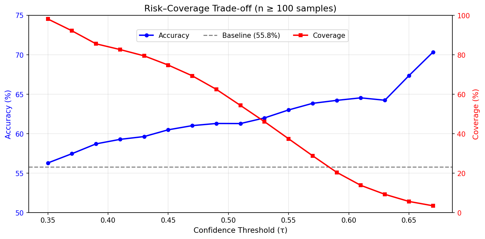

# 📈 ChartVision — Multi-Modal Stock Movement Prediction


> Multi-modal deep learning system combining **candlestick chart images** (CNN) and **technical indicators** (LSTM) for stock movement prediction.

## 🚀 Live Demo
[](https://chartvision-indevelopment-hwjfgsci6gqnavzpndv723.streamlit.app/)

## 📊 Results

| Model | Val Accuracy |
|---|---|
| LSTM (Time Series only) | 43.29% |
| CNN (Chart Images only) | 52.70% |
| **Multi-Modal (CNN + LSTM)** | **53.07%** |

| Ticker | Sharpe Ratio | Strategy Return | Buy & Hold |
|---|---|---|---|
| AAPL | -0.27 | -0.8% | +30.6% |
| MSFT | 1.64 | +87.5% | -5.6% |
| GOOGL | 2.18 | +85.8% | +10.3% |
| TSLA | 0.42 | — | — |

### 🎯 Selective Prediction — ve Neden Yanıltıcı Olduğu

Model her gün tahmin yapmak zorunda değil. Softmax güven skoruna eşik uygulandığında
accuracy %55.8'den %70.3'e çıkıyor:



| Threshold (τ) | Coverage | Accuracy | Samples |
|---|---|---|---|
| — (full) | 100% | 55.8% | 3408 |
| 0.45 | 74.8% | 60.5% | 2549 |
| 0.53 | 46.1% | 62.0% | 1571 |
| 0.67 | 3.5% | **70.3%** | 118 |

**Ancak bu kazanım gerçek değil.** Yüksek güvenli tahminlerin sınıf dağılımı incelendiğinde:

| Threshold | Aşağı | Yatay | Yukarı |
|---|---|---|---|
| 0.35 | 0.0% | 91.7% | 8.3% |
| 0.45 | 0.0% | **100%** | 0.0% |
| 0.65 | 0.0% | **100%** | 0.0% |

Model "Aşağı" sınıfını **hiç tahmin etmiyor**, ve τ ≥ 0.45'te tahminlerin tamamı "Yatay".
Yani yüksek accuracy, modelin bir şey öğrenmesinden değil, belirsizlikte
**çoğunluk sınıfına kaçmasından** kaynaklanıyor.

### 💸 Backtesting Bunu Doğruluyor

| τ | İşlem | Sharpe | Getiri | Win Rate |
|---|---|---|---|---|
| 0.35 | 279 | **-0.10** | -12.5% | 52.7% |
| ≥0.45 | **0** | — | — | — |

- τ ≥ 0.45'te **hiç işlem sinyali yok** — model sadece "yatay" dediği için pozisyon açılmıyor.
- τ = 0.35'te 279 işlem yapılıyor ama Sharpe negatif: ortalama kazanç +%1.75,
  ortalama kayıp -%1.98. %52.7 isabet bu asimetriyi kapatmaya yetmiyor.
- Bu rakamlara işlem maliyeti ve slippage **dahil değil** — eklendiğinde tablo daha da kötüleşir.

**Sonuç:** Sınıflandırma performansı ile trading kârlılığı aynı şey değil.
Accuracy baseline'ın üstünde olsa da, model gerçek dünyada kullanılabilir bir sinyal üretmiyor.

## 🏗️ Architecture

```
Candlestick Chart (PNG)
↓
ResNet18 (CNN)
↓
128-dim embedding
↓                    → Fusion (272-dim) → 3-class output
128-dim embedding
↑
LSTM (2 layers)
↑
Technical Indicators
(RSI, MACD, Bollinger Bands,
Volume SMA, OHLCV)
↑
Ticker Embedding (16-dim)
```

## 📁 Project Structure

```
chartvision/
├── app.py                  # Streamlit demo
├── src/
│   └── model.py            # Model mimarisi
├── models/
│   ├── best_multimodal_v3.pth
│   └── scaler.pkl
├── requirements.txt
├── README.md
└── DEVELOPMENT.md          # Geliştirme süreci ve iyileştirme planı
```

## 🛠️ Tech Stack

- **Model:** PyTorch, ResNet18, LSTM, Ticker Embedding
- **Data:** yfinance, mplfinance, ta (technical analysis)
- **Demo:** Streamlit
- **Training:** Google Colab (T4 GPU)

## 📈 Dataset

- **Hisseler:** AAPL, MSFT, GOOGL, TSLA
- **Dönem:** 2019-2024 (6 yıl)
- **Toplam örnek:** 5,664
- **Train/Val/Test:** 70% / 15% / 15% (zamansal split)
- **Görüntü sayısı:** 5,796 mum grafiği PNG

## 🔍 How It Works

1. Son 60 günlük OHLCV verisi indirilir
2. Mum grafiği PNG olarak üretilir → ResNet18'e verilir
3. Teknik indikatörler hesaplanır → LSTM'e verilir
4. Ticker embedding eklenir
5. CNN + LSTM + Embedding birleştirilir
6. 3 sınıf tahmin üretilir: ⬆️ Yukarı / ➡️ Yatay / ⬇️ Aşağı

## ⚠️ Disclaimer

Bu proje bir **ML araştırma projesidir**. Yatırım tavsiyesi değildir.
Backtesting sonuçları gerçek trading performansını yansıtmaz
(transaction cost, slippage hesaba katılmamıştır).

## 👤 Author

[yusufsmnc](https://github.com/yusufsmnc)